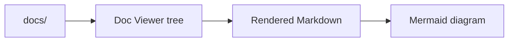

# @yieldcraft/doc-viewer

A pi-web workspace plugin for browsing, searching, rendering, and editing Markdown documentation from a project `docs/` directory.

Doc Viewer gives every pi-web workspace a documentation panel: a collapsible file tree on the left, rendered Markdown on the right, Mermaid diagrams, full-text search, copyable code blocks, and a remote-safe Markdown editor.

## What it does

| Area | Behavior |
| --- | --- |
| Plugin type | pi-web plugin only |
| pi-web plugin id | `doc-viewer` |
| Plugin module | `pi-web-plugin.js` |
| Source directory | Workspace `docs/` folder |
| File types | `.md`, `.mdx`, `.markdown` |
| Main action | **Open Documentation Viewer** (`mod+shift+d`) |

## Requirements

- [pi-web](https://github.com/earendil-works/pi-web) with the stable workspace `files` plugin API.
- ⚠️ This version depends on the new `files.writeFile()` and `files.deleteFile()` plugin APIs introduced in the PR currently under review: `https://github.com/jmfederico/pi-web/pull/23`
- Until that PR is merged and released, this version of `doc-viewer` only works against a pi-web build that includes those APIs. Older pi-web releases do not provide `context.files.writeFile` / `context.files.deleteFile`, so editing and inline deletion will fail.

## Features

- **Recursive docs browser** — discovers Markdown files under `docs/`, including nested folders.
- **Readable tree navigation** — shows the `docs/` root, folder/file/index icons, H1 titles when available, and `index.md` first in each folder.
- **Collapsed nested folders** — nested folders start collapsed; click a folder row to expand or collapse it.
- **Normal mode and focus mode** — normal mode lives inside the pi-web workspace panel; focus mode uses a CSS overlay with toolbar on top, tree on the left, and the viewer on the right.
- **Full-text search** — searches all discovered docs files, sorts title matches first, and highlights matching snippets.
- **Markdown rendering** — supports headings, emphasis, links, images, lists, blockquotes, tables, horizontal rules, inline code, and fenced code blocks.
- **Mermaid diagrams** — renders fenced `mermaid` code blocks in the document view.
- **Code block tools** — code blocks are scrollable, preserve newlines, and include a copy button.
- **Markdown edit mode** — edit the selected document, then save or cancel without modifying pi-web itself.
- **Stable file saves** — writes changes through pi-web's stable workspace `files.writeFile()` API, so saves happen in the active workspace environment on both local and federated machines.
- **Inline delete for `docs/tmp/` files** — each Markdown file directly inside `docs/tmp/` shows a trash icon on the right side of the tree row. Clicking it deletes the file from the workspace after confirmation.

## Install

Use the package through pi-web's plugin/package workflow once it is available from npm:

```sh
npm install @yieldcraft/doc-viewer
```

For local development, link this package into the local pi-web plugin directory:

```sh
npm run dev:link
```

To remove the development link:

```sh
npm run dev:unlink
```

The package advertises its plugin metadata in `package.json`:

```json
{
  "piWeb": {
    "plugins": [
      {
        "id": "doc-viewer",
        "module": "pi-web-plugin.js"
      }
    ]
  }
}
```

## Use

1. Add Markdown files to your workspace `docs/` directory.
2. Open a pi-web workspace that has this plugin installed.
3. Run **Open Documentation Viewer** or press `mod+shift+d`.
4. Select a file from the tree to render it.
5. Use the toolbar to search, refresh the tree, copy the full file path, edit the file, or toggle focus mode.

### Recommended docs layout

```text
docs/
├── index.md
├── architecture.md
├── api-reference.md
└── guides/
    ├── index.md
    └── first-task.md
```

`index.md` files are shown first within their folder. If a document starts with an H1 heading, that heading is used as the display title.

## Focus mode

Focus mode is a layout mode, not browser fullscreen. It does **not** call the browser Fullscreen API, does not use `requestFullscreen`, and does not exit on `Esc`.

In focus mode:

- the toolbar is fixed at the top;
- the docs tree stays on the left;
- the viewer/editor fills the right side;
- the layout is approximately 25% navigation and 75% content.

Use the focus button again to return to normal mode.

## Mermaid example

````markdown

````

## Development notes

Doc Viewer follows pi-web's dynamic panel pattern:

- `render()` is synchronous and returns the static shell sections: `<section class="toolbar">` and `<section class="viewer">`.
- Async file-tree and file-content work is scheduled after the shell mounts.
- DOM updates use `querySelectorAllDeep`, `queueMicrotask`, and `requestAnimationFrame`.
- The implementation does not call `requestRender()` from `render()`.
- Edit saves and inline deletes use pi-web's stable `context.files.writeFile()` and `context.files.deleteFile()` APIs (no shell commands).

Run a syntax/import smoke test:

```sh
node --eval "import('./pi-web-plugin.js').then(() => console.log('unexpected browser globals ok')).catch(e => { if (String(e.message).includes('window is not defined')) console.log('Parsed OK'); else { console.error(e); process.exit(1); } })"
```

Check npm package contents:

```sh
npm pack --dry-run
```

## Public package contents

The npm package allowlist is intentionally small:

- `pi-web-plugin.js`
- `README.md`
- `docs/*.md`
- `.pi-web/tasks.json`

Temporary working material and ignored artifacts must stay out of the public package.

## Documentation

- [Docs home](docs/index.md)
- [Documentation guide](docs/README.md)
- [Architecture](docs/architecture.md)
- [Implementation approach](docs/approach.md)
- [Mermaid support](docs/mermaid.md)
- [API reference](docs/api-reference.md)
- [Troubleshooting](docs/troubleshooting.md)

## License

MIT
