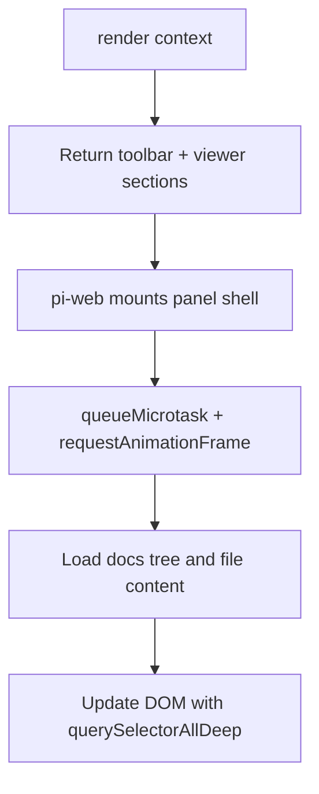

# Implementation Approach

Doc Viewer is designed to feel native inside pi-web while staying simple enough to publish as a clean public plugin package.

## Goals

1. Make workspace documentation visible without leaving pi-web.
2. Keep the implementation browser-side and plugin-only.
3. Render Markdown and Mermaid diagrams reliably.
4. Support safe in-place Markdown edits in remote workspaces.
5. Keep the public npm/GitHub snapshot free of non-public notes and ignored artifacts.

## Non-goals

Doc Viewer does not try to be a full documentation site generator. It does not build static HTML, run a docs server, or replace a dedicated docs platform. It is a workspace reader and editor for the `docs/` folder.

It also does not modify pi-web source code. All behavior is delivered by the plugin module and pi-web extension points.

## Dynamic panel pattern

The panel follows a synchronous shell plus scheduled DOM updates pattern.

This keeps `render()` predictable while still allowing asynchronous file discovery, search, edit mounting, and Mermaid rendering.

Rules used by the implementation:

- Return the panel shell synchronously.
- Schedule DOM work after mount.
- Use deep DOM queries when wiring toolbar and viewer elements.
- Keep async file reads outside the render return path.
- Avoid `requestRender()` calls from `render()`.

## File discovery approach

Doc Viewer treats `docs/` as the only public documentation root. It recursively includes these extensions:

- `.md`
- `.mdx`
- `.markdown`

Each discovered file is read once to extract an H1 title for navigation. If no H1 exists, the plugin falls back to a readable file-based label.

Sorting is optimized for reader orientation:

1. `docs/` appears as the root.
2. Root files appear before nested folders.
3. `index.md` appears first in each folder.
4. Remaining files and folders sort alphabetically.
5. Nested folders start collapsed.

## Search approach

Search is intentionally direct and predictable:

- The toolbar input waits 300ms before searching.
- Searches run across all discovered docs files.
- Matching snippets are highlighted.
- Title matches rank before body-only matches.
- Selecting a result clears search mode and opens that file.

Search is client-side over loaded Markdown content. Refreshing the tree clears cached content so the next search uses current files.

## Markdown rendering approach

The renderer favors documentation readability over exhaustive CommonMark coverage. It supports the constructs most project docs use every day:

| Markdown feature | Supported behavior |
| --- | --- |
| Headings | Rendered with stable slug ids and used for the page contents list. |
| Paragraphs | Rendered as readable text blocks. |
| Emphasis | Bold, italic, and strikethrough. |
| Links and images | Rendered with safe link attributes and responsive image sizing. |
| Lists | Ordered and unordered lists. |
| Blockquotes | Rendered as callout-like quoted blocks. |
| Tables | Rendered as compact data grids. |
| Fenced code | Rendered in scrollable code widgets with copy buttons. |
| Mermaid fences | Rendered as diagrams after the document mounts. |

## Edit approach

Edit mode is intentionally conservative:

1. The selected file's Markdown is copied into a textarea.
2. Save runs a workspace terminal command that writes the file with Node.js.
3. On success, caches are updated and the rendered view is refreshed.
4. Cancel drops the draft and restores view mode.

This approach works for local and remote workspaces because the write happens in the workspace environment rather than through a browser-only file API.

## Normal mode vs focus mode

Use these terms consistently:

| Term | Meaning |
| --- | --- |
| Normal mode | The default panel experience inside pi-web's workspace layout. |
| Focus mode | A CSS overlay layout for reading or editing docs with more screen space. |

Focus mode is not browser fullscreen. It does not use the Fullscreen API, does not call `requestFullscreen`, and does not exit when the user presses `Esc`.

## Public release approach

The public release should be a clean snapshot of the plugin package, not a dump of development history or temporary working material.

Before publishing or mirroring publicly:

1. Keep package contents constrained by the `files` allowlist in `package.json`.
2. Confirm ignored working material is not included.
3. Run `npm pack --dry-run` and inspect the file list.
4. Scan public docs and package files for non-public hosts, tokens, local paths, and temporary artifacts.
5. Keep README and `docs/*.md` English-only and accurate to the implementation.

## Maintenance checklist

Use this checklist when changing the plugin:

- [ ] Update README if installation, commands, package metadata, or user-facing features changed.
- [ ] Update `docs/api-reference.md` if plugin ids, actions, extensions, or integration points changed.
- [ ] Update `docs/architecture.md` if rendering, state, search, or save flow changed.
- [ ] Update `docs/troubleshooting.md` when new failure modes are found.
- [ ] Keep `docs/index.md` as the public docs landing page.
- [ ] Do not publish ignored working notes or temporary files.
- [ ] Run the import smoke test.
- [ ] Run `npm pack --dry-run`.
