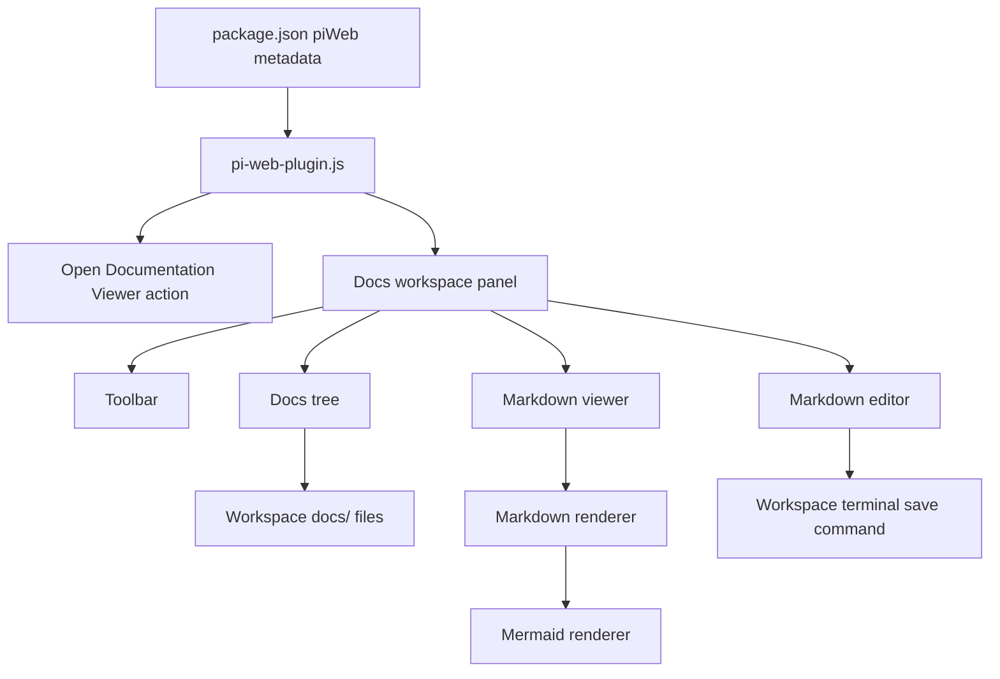
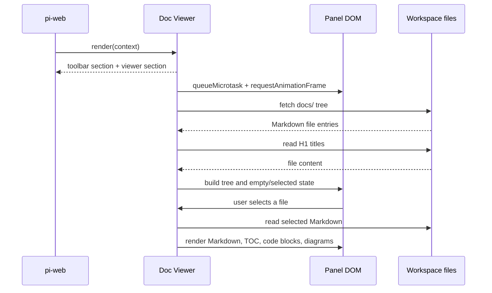
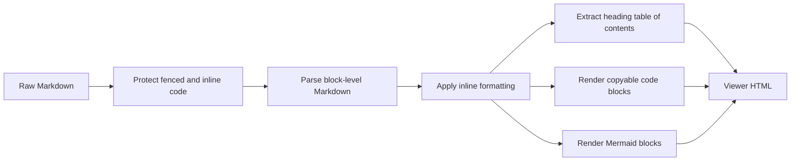
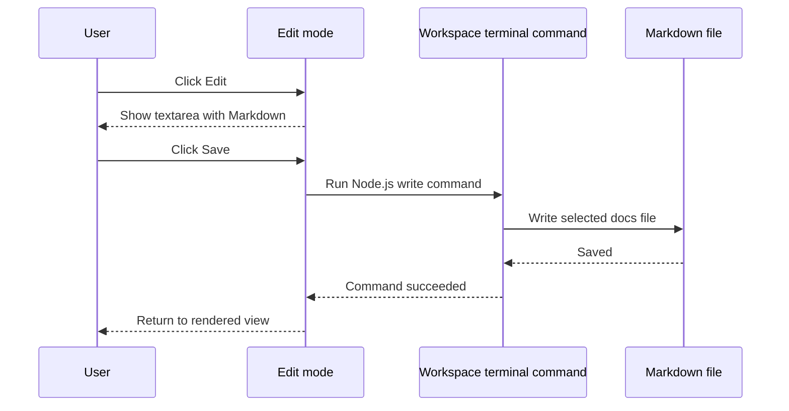

# Architecture

Doc Viewer is a single-file pi-web plugin. It contributes a workspace panel, discovers Markdown files under the active workspace `docs/` directory, and renders the selected file inside the pi-web UI.

## Package shape

| Item | Value |
| --- | --- |
| npm package | `@yieldcraft/doc-viewer` |
| pi-web plugin id | `doc-viewer` |
| Plugin module | `pi-web-plugin.js` |
| Runtime | Browser-side pi-web plugin module |
| Workspace source | `docs/` |
| Supported extensions | `.md`, `.mdx`, `.markdown` |

## High-level components

## Discovery and tree building

Doc Viewer discovers documentation by asking pi-web for the workspace tree at `docs/` and recursively walking returned directory entries.

Discovery rules:

1. Start at `docs/`.
2. Include files ending in `.md`, `.mdx`, or `.markdown`.
3. Recurse into nested folders.
4. Sort root-level docs before nested docs.
5. Sort `index.md` first within each folder.
6. Read each file's first H1 heading and use it as the tree label when present.
7. Start nested folders collapsed by default.

The tree keeps the `docs/` root visible. Users can click the root or any nested folder row to expand or collapse it.

## Rendering lifecycle

The pi-web panel render function stays synchronous. It returns a stable shell, then schedules DOM work once the shell exists.

Important implementation constraints:

- `render()` returns `<section class="toolbar">` and `<section class="viewer">`.
- Asynchronous file and diagram work happens after the render shell is mounted.
- DOM lookups use `querySelectorAllDeep` so the plugin works through pi-web's nested DOM/shadow boundaries.
- DOM updates are scheduled with `queueMicrotask` and `requestAnimationFrame`.
- The plugin does not call `requestRender()` from `render()`.

## State model

Doc Viewer keeps browser-side state for the active workspace panel.

| State | Purpose |
| --- | --- |
| `currentFile` | Selected documentation file path. |
| `fileTree` | Flattened list of discovered Markdown files. |
| `fileTitles` | H1-derived labels for tree display. |
| `fileContents` | Raw Markdown cache used for reading, search, and edit mode. |
| `renderedFiles` | Rendered HTML cache for selected documents. |
| `collapsedDirs` | Folder collapse state for the active workspace. |
| `mode` | Current content mode: `view`, `search`, or `edit`. |
| `viewMode` | Layout mode: `normal` or `focus`. |

The workspace key is based on the active machine and workspace ids. When the workspace changes, tree, content, title, edit, and search state are reset.

## Markdown pipeline

Supported rendering includes headings, paragraphs, emphasis, deletion, links, images, lists, blockquotes, tables, horizontal rules, inline code, fenced code, and Mermaid diagrams.

## Focus mode architecture

Focus mode is CSS-based. The plugin adds focus classes to the toolbar and viewer sections, producing an overlay layout:

- toolbar fixed at the top;
- viewer section fixed below the toolbar;
- docs tree in the left column;
- content or editor in the right column.

Focus mode does not use browser fullscreen APIs. It does not call `requestFullscreen`, and pressing `Esc` is reserved for search input behavior rather than exiting focus mode.

## Edit/save architecture

Edit mode replaces rendered content with a Markdown textarea. Save uses `context.terminal.runCommand()` to execute a small Node.js write script in the active workspace.

Cancel discards the draft and returns to the previously cached rendered view.

## Package boundary

The public package is intentionally narrow. It includes the plugin module, public docs, root README, and pi-web task metadata. Temporary notes, ignored folders, and non-public release artifacts are outside the package boundary.
