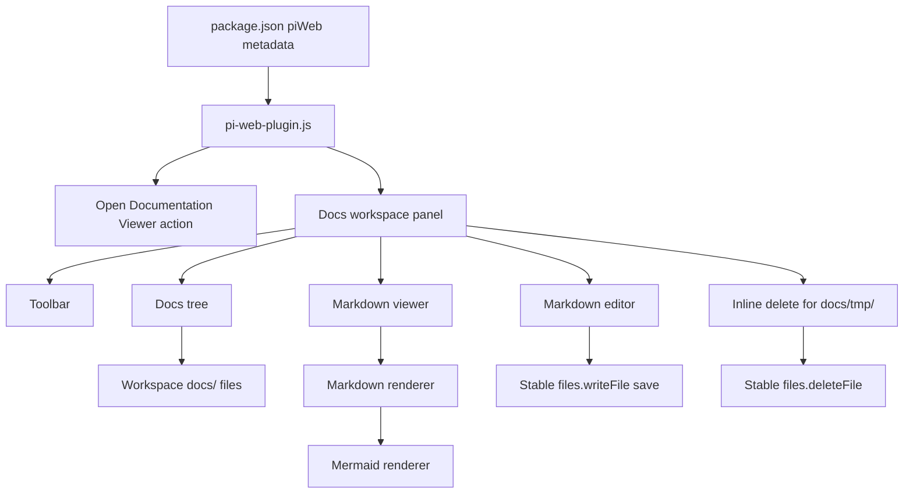
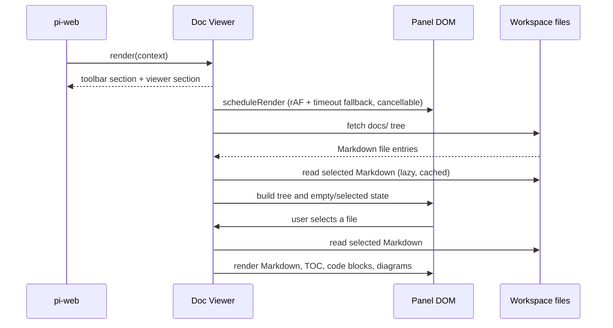
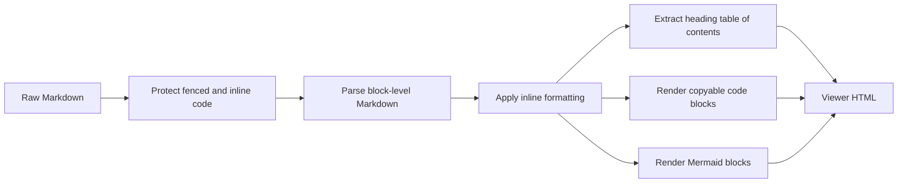
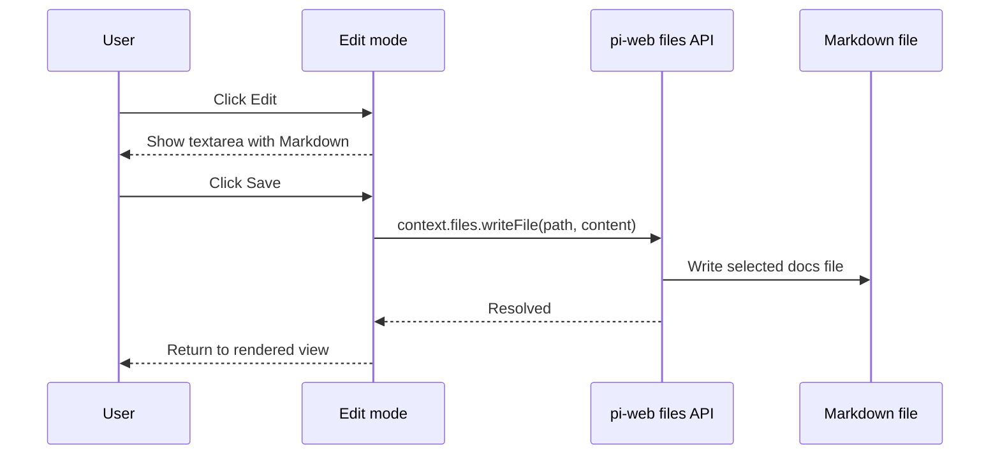

# Architecture

Doc Viewer is a single-file pi-web plugin. It contributes a workspace panel, discovers Markdown files under the active workspace `docs/` directory, and renders the selected file inside the pi-web UI.

## Package shape

| Item | Value |
| --- | --- |
| npm package | `@yieldcraft/doc-viewer` |
| pi-web plugin id | `doc-viewer` |
| Plugin module | `pi-web-plugin.js` |
| Runtime | Browser-side pi-web plugin module |
| Workspace source | `docs/` |
| Supported extensions | `.md`, `.mdx`, `.markdown` |

## High-level components

## Discovery and tree building

Doc Viewer discovers documentation by asking pi-web for the workspace tree at `docs/` and recursively walking returned directory entries.

Discovery rules:

1. Start at `docs/`.
2. Include files ending in `.md`, `.mdx`, or `.markdown`.
3. Recurse into nested folders.
4. Sort root-level docs before nested docs.
5. Sort `index.md` first within each folder.
6. Use each file's first H1 heading as the tree label when present (extracted lazily when a file is first read, not bulk-fetched on tree load).
7. Start nested folders collapsed by default.

The tree keeps the `docs/` root visible. Users can click the root or any nested folder row to expand or collapse it.

## Rendering lifecycle

The pi-web panel render function stays synchronous. It returns a stable shell, then schedules DOM work once the shell exists.

Important implementation constraints:

- `render()` returns `<section class="toolbar">` and `<section class="viewer">`.
- Asynchronous file and diagram work happens after the render shell is mounted.
- DOM lookups use `querySelectorAllDeep` so the plugin works through pi-web's nested DOM/shadow boundaries.
- DOM updates are scheduled with `scheduleRender()` (a single tracked `requestAnimationFrame` plus a `setTimeout` fallback). Pending callbacks are cancelled on every new `render()` and on `deactivate()` so renders never accumulate.
- The plugin does not call `requestRender()` from `render()`.

## State model

Doc Viewer keeps browser-side state for the active workspace panel.

| State | Purpose |
| --- | --- |
| `currentFile` | Selected documentation file path. |
| `fileTree` | Flattened list of discovered Markdown files. |
| `fileTitles` | H1-derived labels for tree display. |
| `fileContents` | Raw Markdown cache used for reading, search, and edit mode. |
| `renderedFiles` | Rendered HTML cache for selected documents (bounded LRU, max 50). |
| `collapsedDirs` | Folder collapse state for the active workspace. |
| `mode` | Current content mode: `view`, `search`, or `edit`. |
| `viewMode` | Layout mode: `normal` or `focus`. |
| `--dv-sidebar-w` | Focus-mode sidebar width CSS variable, persisted to `localStorage`. |
| `pendingRafIds` / `pendingTimeoutIds` | Tracked scheduled-render callback ids, cancelled on new render and deactivate. |

The workspace key is based on the active machine and workspace ids. When the workspace changes, tree, content, title, edit, and search state are reset. `deactivate()` additionally cancels pending renders, unwires the toolbar and resizer listeners, stops the Mermaid poller, and removes injected DOM elements (toast container, Mermaid script, global copy handler).

## Markdown pipeline

Supported rendering includes headings, paragraphs, emphasis, deletion, links, images, lists, blockquotes, tables, horizontal rules, inline code, fenced code, and Mermaid diagrams.

## Focus mode architecture

Focus mode is CSS-based. The plugin adds focus classes to the toolbar and viewer sections, producing an overlay layout:

- toolbar fixed at the top;
- viewer section fixed below the toolbar;
- docs tree in the left column;
- content or editor in the right column.

Focus mode does not use browser fullscreen APIs. It does not call `requestFullscreen`, and pressing `Esc` is reserved for search input behavior rather than exiting focus mode.

### Resizable sidebar

In focus mode, the divider between the docs tree and the content column is draggable. Dragging it updates the `--dv-sidebar-w` CSS variable on the layout element and persists the chosen width to `localStorage` (`doc-viewer:sidebar-width`). On the next focus-mode session, the persisted width is reapplied. The sidebar clamps between a minimum of 180px and a maximum of 60% of the panel width. The resizer handle and its drag listeners are wired only while focus mode is active and are cleaned up on deactivate. In normal mode the divider is hidden and the layout is non-resizable.

## Edit/save architecture

Edit mode replaces rendered content with a Markdown textarea. Save uses pi-web's stable `context.files.writeFile()` API to write the edited content directly in the active workspace (local or federated). No shell commands or Node.js scripts are involved.

Cancel discards the draft and returns to the previously cached rendered view.

## Inline delete architecture

Markdown files located directly inside `docs/tmp/` show a trash icon on the right side of their tree row. Clicking it asks for confirmation, then calls `context.files.deleteFile(path)`. On success the file is removed from the tree and caches, and the panel re-renders. Files outside `docs/tmp/` do not expose delete to avoid accidental removal of permanent documentation.

## Package boundary

The public package is intentionally narrow. It includes the plugin module, public docs, root README, and pi-web task metadata. Temporary notes, ignored folders, and non-public release artifacts are outside the package boundary.
