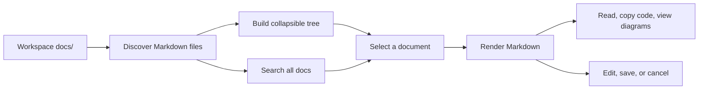

# Doc Viewer Documentation

Welcome to the public documentation for `@yieldcraft/doc-viewer`, a pi-web plugin that turns a workspace `docs/` folder into an in-app documentation browser.

## Quick start

1. Install or link the plugin in pi-web.
2. Add Markdown files to your workspace `docs/` directory.
3. Open **Doc Viewer** from the workspace tools or run **Open Documentation Viewer**.
4. Browse, search, read, diagram, and edit your documentation without leaving the workspace.

## What Doc Viewer provides

| Need | Doc Viewer behavior |
| --- | --- |
| Browse project docs | Recursively lists `.md`, `.mdx`, and `.markdown` files under `docs/`. |
| Understand structure | Shows the `docs/` root, folder icons, file icons, index icons, H1 titles, and `index.md` first. |
| Reduce visual clutter | Starts nested folders collapsed and lets users expand or collapse folders by clicking them. |
| Find content | Searches all discovered docs files and highlights matches in result snippets. |
| Read Markdown | Renders common Markdown, tables, code blocks, and Mermaid diagrams. |
| Edit in place | Provides Markdown edit/save/cancel through pi-web's stable `files.writeFile()` API. |
| Delete tmp files | Files directly inside `docs/tmp/` show a trash icon for inline deletion via `files.deleteFile()`. |
| Copy content | Toolbar action copies the selected Markdown file's raw content to the clipboard. |
| Focus on docs | Offers normal mode and CSS-based focus mode with a draggable sidebar divider. |

## Documentation map

| Page | Use it when you need to... |
| --- | --- |
| [README](README.md) | Understand the documentation set and navigation conventions. |
| [Architecture](architecture.md) | See how the plugin discovers files, renders content, and updates the panel. |
| [Approach](approach.md) | Learn the implementation rules and public release practices. |
| [Mermaid](mermaid.md) | Write Mermaid diagrams that render well in Doc Viewer. |
| [API reference](api-reference.md) | Check plugin metadata, pi-web integration points, and supported file behavior. |
| [Troubleshooting](troubleshooting.md) | Diagnose empty trees, missing diagrams, search issues, and save failures. |

## Recommended workspace layout

```text
docs/
├── index.md
├── architecture.md
├── api-reference.md
├── troubleshooting.md
└── guides/
    ├── index.md
    └── first-task.md
```

A `docs/index.md` file is recommended because it gives readers a predictable landing page and appears first in the tree.

## Modes

| Mode | Description |
| --- | --- |
| Normal mode | The default pi-web panel layout. The toolbar sits above the viewer section, and the docs panel participates in the normal workspace layout. |
| Focus mode | A CSS overlay layout with the toolbar fixed at the top, the tree on the left, and the viewer on the right. The divider between tree and content is draggable and the width persists across sessions. It does not use browser fullscreen. |

## End-to-end flow


