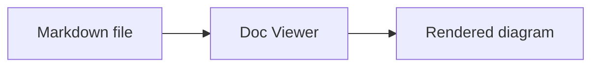
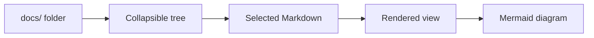
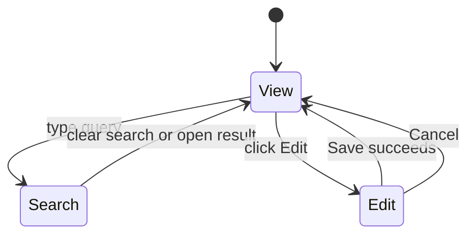
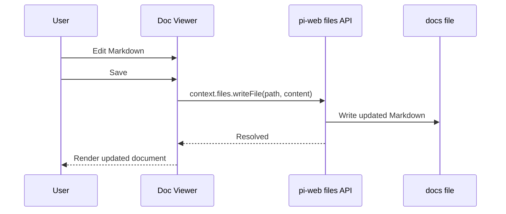

# Mermaid Support

Doc Viewer renders Mermaid diagrams from fenced code blocks labeled `mermaid`.

Use Mermaid when a relationship, flow, or state change is clearer as a picture than as a paragraph.

## Basic syntax

Write a fenced code block with `mermaid` as the language:

````markdown

````

Doc Viewer hides the Mermaid source block and replaces it with the rendered diagram after the page content is mounted.

## Example: plugin flow



## Example: edit state



## Example: save sequence



## Authoring guidelines

| Do | Why |
| --- | --- |
| Keep node labels short. | Long labels make diagrams hard to scan in a panel. |
| Prefer left-to-right flowcharts for processes. | They fit the viewer column well, especially in focus mode. |
| Use sequence diagrams for API or save flows. | They show who does what over time. |
| Use state diagrams for modes. | They make transitions easier to verify. |
| Keep diagrams close to the text they explain. | Readers should not hunt for the picture. |

## Rendering behavior

- Mermaid is loaded on demand when the first diagram needs rendering.
- The plugin uses Mermaid version `11`.
- Diagrams render after Markdown HTML is inserted into the panel.
- If a diagram cannot render, Doc Viewer shows the error message in the diagram area instead of failing the whole page.
- Focus mode gives diagrams more horizontal space, but diagrams should still be readable in normal mode.

## Troubleshooting diagrams

If a diagram does not render:

1. Confirm the fence language is exactly `mermaid`.
2. Check Mermaid syntax in the code block.
3. Try a smaller diagram to isolate the failing line.
4. Refresh the file tree and re-open the document.
5. Open browser developer tools and look for a Mermaid syntax error.

## Good diagram candidates

Mermaid is especially useful for:

- plugin architecture;
- user flows;
- render lifecycles;
- save/edit sequences;
- release checklists;
- state transitions between normal mode, focus mode, search mode, and edit mode.

Use prose for simple facts. Use a diagram when the reader needs to see structure.
